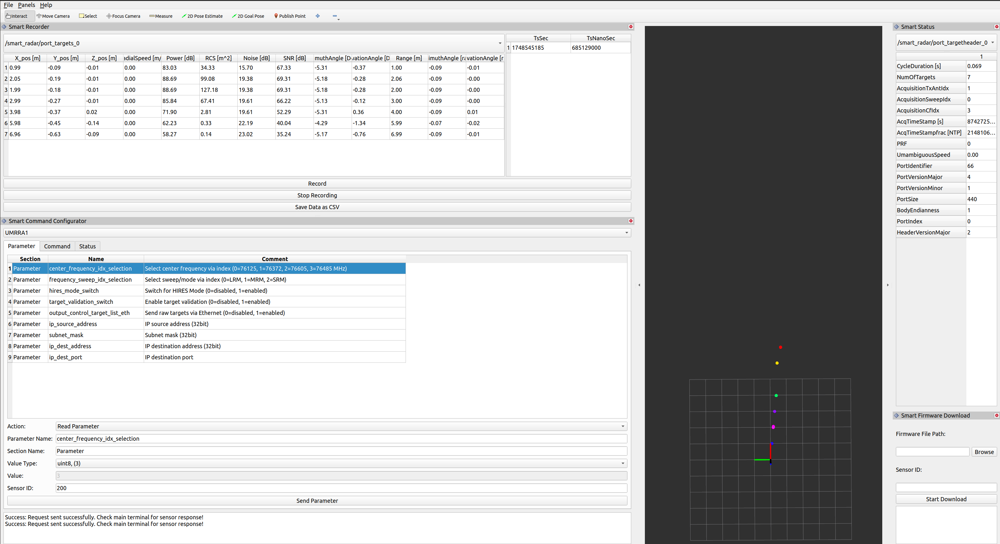

# ROS2 smartmicro radar driver

[](https://github.com/smartmicro/smartmicro_ros2_radars/actions/workflows/dockerbuild.yml)

## Purpose / Use cases
There is a need for a node that will interface with a smartmicro radar driver and publish the data
acquired by the sensor through the ROS2 pipeline. This package implements such a node.

## Get the Smart Access release
```bash
./smart_extract.sh
```

## How to launch this node
```
ros2 launch umrr_ros2_driver radar.launch.py
```

## How to launch the rviz with recorder plugin
From a separate terminal and after sourcing workspace
```
rviz2 -d smartmicro_ros2_radars/umrr_ros2_driver/config/rviz/smart_plugin.rviz
```



## How to start the custom can message sender
From smart_rviz_plugin folder
```
python custom_can_sender.py
```


## Prerequisites

### Supported ROS distributions:
- ROS2 foxy

### UMRR radars and Smart Access API version
A [smartmicro](https://www.smartmicro.com/automotive-radar) UMRR96, UMRR11, DRVEGRD 171, DRVEGRD 152, DRVEGRD 169, DRVEGRD 169 MSE or DRVEGRD 171 MSE radar is 
required to run this node. This code is bundled with a version of Smart Access API. Please make
sure the version used to publish the data is compatible with this version:

- Date of release: `March 03, 2026`
- Smart Access Automotive version: `v3.11.0`

For each sensor user interface there is a corressponding sensor firmware. The following list all the possible combinations. 

| **User Interface Version**                       | **Sensor Firmware Version**         |
|--------------------------------------------------|-------------------------------------|
| UMRR96 Type 153 AUTOMOTIVE v1.2.1                | UMRR96 Type 153: V5.2.4             |
| UMRR96 Type 153 AUTOMOTIVE v1.2.2                | UMRR96 Type 153: V5.2.4             |
| UMRR11 Type 132 AUTOMOTIVE v1.1.1                | UMRR11 Type 132: V5.1.4             |
| UMRR11 Type 132 AUTOMOTIVE v1.1.2                | UMRR11 Type 132: V5.1.4             |
| UMRR9F Type 169 AUTOMOTIVE v1.1.1                | UMRR9F Type 169: V1.3.0             |
| UMRR9F Type 169 AUTOMOTIVE v2.0.0                | UMRR9F Type 169: V2.0.1             |
| UMRR9F Type 169 AUTOMOTIVE v2.1.1                | UMRR9F Type 169: V2.0.1             |
| UMRR9F Type 169 AUTOMOTIVE v2.2.0                | UMRR9F Type 169: V2.2.0             |
| UMRR9F Type 169 AUTOMOTIVE v2.2.1                | UMRR9F Type 169: V2.2.0             |
| UMRR9F Type 169 AUTOMOTIVE v2.4.1                | UMRR9F Type 169: V2.4.0             |
| UMRR9D Type 152 AUTOMOTIVE v1.0.2                | UMRR9D Type 152: V2.1.0             |
| UMRR9D Type 152 AUTOMOTIVE v1.0.3                | UMRR9D Type 152: V2.5.0             |
| UMRR9D Type 152 AUTOMOTIVE v1.2.2                | UMRR9D Type 152: V2.5.0             |
| UMRR9D Type 152 AUTOMOTIVE v1.4.1                | UMRR9D Type 152: V2.7.0             |
| UMRR9D Type 152 AUTOMOTIVE v1.5.0                | UMRR9D Type 152: V3.3.0             |
| UMRR9D Type 152 AUTOMOTIVE v1.5.0                | UMRR9D Type 152: V3.6.0             |
| UMRRA4 Type 171 AUTOMOTIVE v1.0.0                | UMRRA4 Type 171: V1.0.0             |
| UMRRA4 Type 171 AUTOMOTIVE v1.0.1                | UMRRA4 Type 171: V1.0.0             |
| UMRRA4 Type 171 AUTOMOTIVE v1.2.1                | UMRRA4 Type 171: V1.2.1             |
| UMRRA4 Type 171 AUTOMOTIVE v1.4.0                | UMRRA4 Type 171: V2.0.0             |
| UMRRA4 Type 171 AUTOMOTIVE v1.4.0                | UMRRA4 Type 171: V2.3.0             |
| UMRR11 Type 132 MSE v1.1.1                       | UMRR11 Type 132-MSE: V6.1.2         |
| UMRR9F Type 169 MSE v1.0.0                       | UMRR9F Type 169-MSE: V1.1.0         |
| UMRR9F Type 169 MSE v1.1.0                       | UMRR9F Type 169-MSE: V1.3.0         |
| UMRR9F Type 169 MSE v1.3.0                       | UMRR9F Type 169-MSE: V1.5.0         |
| UMRRA4 Type 171 MSE v1.0.0                       | UMRR9F Type 171-MSE: V1.0.0         |
| UMRRA4 Type 171 MSE v1.3.0                       | UMRR9F Type 171-MSE: V2.1.0         |
| UMRRA1 Type 166 AUTOMOTIVE v1.0.0                | UMRRA1 Type 166: V1.0.0             |
| UMRRA1 Type 166 AUTOMOTIVE v2.0.0                | UMRRA1 Type 166: V1.0.0             |

### Point cloud message wrapper library
To add targets to the point cloud in a safe and quick fashion a
[`point_cloud_msg_wrapper`](https://gitlab.com/ApexAI/point_cloud_msg_wrapper) library is used within
this project's node. This project can be installed either through `rosdep` or manually by executing:
```
sudo apt install ros-foxy-point-cloud-msg-wrapper
```

To use the GUI provided, it is required to install the following package:
```
pip install python-can
```

## Inputs / Outputs / Configuration

### The inputs:
The inputs are coming as network packages generated in either of the following two ways:
- Through directly interfacing with the sensor
- Through a provided pcap file
- Through using the sensor simulators

These inputs are processed through the Smart Access C++ API and trigger a callback. Every time this
callback is triggered a new point cloud message is created and published.

### The outputs:
The driver publishes `sensor_msgs::msg::PointCloud2` messages with the radar targets on the topic
`umrr/targets` which can be remapped through the parameters.

### Interface Configuration:
For setting up a sensor with ethernet or can, the interfaces of the should be set properly prior to configuring the node.
The sensor is equipped with three physical layers (RS485, CAN and ethernet) however the driver uses only ethernet and can:
- ethernet: to set-up an ethernet interface the following command could be used `ifconfig my_interface_name 192.168.11.17 netmask 255.255.255.0`.
The command above uses the default source ip address used by the sensors.
- can: if using LAWICEL to set-up a can interface the following commands could be used `slcand -o -s6 -t hw -S 3000000 /dev/ttyUSBx`and than `ip link set up my_interface_name`.
This uses the default baudrate of _500000_. When using Peak CAN the interfaces are recognized by linux and is only needed to set the baudrate.  

### Node Configuration:
The node is configured through the parameters. Here is a short recap of the most important parts.
For more details, see the [`radar.sensor.example.yaml`](umrr_ros2_driver/param/radar.sensor.example.yaml) and 
[`radar.adapter.example.yaml`](umrr_ros2_driver/param/radar.adapter.example.yaml) files.

To set up the ***sensors***, configure the following parameters:

- **`link_type`**: Specifies the type of hardware connection.

- **`model`**: Defines the model of the sensor being used.  
  - **CAN Models**:  
    'umrra4_can_mse_v1_0_0', 'umrra4_can_mse_v2_1_0', 'umrr9f_can_mse_v1_1_0', 'umrr9f_can_mse_v1_0_0', 'umrr96_can_v1_2_2',
    'umrr11_can_v1_1_2', 'umrr9f_can_v2_1_1', 'umrr9f_can_v2_2_1', 'umrr9f_can_v2_4_1', 'umrr9f_can_v3_0_0', 'umrr9d_can_v1_0_3',
    'umrr9d_can_v1_2_2', 'umrr9d_can_v1_4_1', 'umrr9d_can_v1_5_0', 'umrra4_can_v1_0_1', 'umrra4_can_v1_2_1', 'umrra4_can_v1_4_0'
  - **Port Models**:  
    'umrra1_v2_0_0', 'umrra1_v1_0_0', 'umrra4_mse_v1_0_0', 'umrra4_mse_v2_1_0', 'umrr9f_mse_v1_3_0', 'umrr9f_mse_v1_1_0',
    'umrr9f_mse_v1_0_0', 'umrr96_v1_2_2', 'umrr11_v1_1_2', 'umrr9f_v2_1_1', 'umrr9f_v2_2_1', 'umrr9f_v2_4_1','umrr9f_v3_0_0',
    'umrr9d_v1_0_3', 'umrr9d_v1_2_2', 'umrr9d_v1_4_1', 'umrr9d_v1_5_0', 'umrra4_v1_0_1', 'umrra4_v1_2_1', 'umrra4_v1_4_0'

- **`dev_id`**: Adapter ID to which the sensor is connected.  
  ***Note:*** The adapter and sensor must have the same `dev_id`.

- **`id`**: The client ID of the sensor/source.  
  ***Must be a unique, non-zero integer.***

- **`ip`**: The ***unique*** IP address of the sensor or source acting as a sensor.  
  ***Required only for sensors using Ethernet.***

- **`port`**: Port used to receive packets.  
  ***Required only for sensors using Ethernet and default is:*** `55555`.

- **`frame_id`**: Name of the frame in which messages will be published.

- **`history_size`**: Size of the history buffer for the message publisher.

- **`inst_type`**: Instruction serialization type.  
  ***Relevant for Ethernet sensors.***. 
  ***Should be set to:*** `port_based`.

- **`data_type`**: Data serialization type.  
  ***Relevant for Ethernet sensors.***. 
  ***Should be set to:*** `port_based`.

- **`uifname`**: User interface name of the sensor (refer to the [`user_interfaces`](umrr_ros2_driver/smartmicro/user_interfaces/)).
  - **`uifmajorv`**: Major version of the sensor user interface.
  - **`uifminorv`**: Minor version of the sensor user interface.
  - **`uifpatchv`**: Patch version of the sensor user interface.

To set up the ***adapters***, configure the following parameters:

- **`master_inst_serial_type`**: Instruction serilization type of the master.
  ***Note:*** When using a hybrid of `can` and `port` use `can_based`.

- **`master_data_serial_type`**: Data serilization type of the master.
  ***Note:*** When using a hybrid of `can` and `port` use `can_based`.

- **`hw_type`**: Specifies the type of the hardware connection.

- **`hw_dev_id`**: Adapter id of the hardware.
  ***Note:*** The adapter and sensor must have the same `dev_id`.

- **`hw_iface_name`**: Name of the used network interface.

- **`baudrate`**: Baudrate of the sensor connected with CAN.
  ***Required only for sensors using CAN and default is:*** _500000_.

- **`port`**: Port used to receive packets.  
  ***Required only for sensors using Ethernet and default is:*** _55555_.

## Mode of operations of the sensors
The smartmicro radars come equipped with numerous features and modes of operation. Using the ros2 services provided one
may access these modes and send commands to the sensor. A list of available sensor operations is given in the [`user_interfaces`](umrr_ros2_driver/smartmicro/user_interfaces/).

A ros2 `SetMode` service should be called to implement these mode changes. These are the inputs to a ros2 `SetMode` service call:
- `params`: name/names of the mode instructions (specific to the sensor).
- `values`: the mode of operation (specific to sensor where the modes are same).
- `sensor_id`: the id of the sensor to which the service call should be sent.
- `value_types`: the data types for the params `0: float32, 1: uint32, 2: uint16, 3: uint8`.
- `section_name`: the name of the section in the instruction file.

For instance, changing the `Index of center frequency (center_frequency_idx)` of a UMRR-A4 sensor to `(1)` mode would require the following call:
`ros2 service call /smart_radar/set_radar_mode umrr_ros2_msgs/srv/SetMode "{section_name: auto_interface_0dim, sensor_id: 100, params: ['center_frequency_idx'], values: ['1'], value_types: [3]}"`

A ros2 'GetMode' service can be called to get the actual sensor modes. The inputs for this call are:
- `params`: name/names of the mode instructions (specific to the sensor).
- `sensor_id`: the id of the sensor to which the service call should be sent.
- `param_types`: the data types for the params `0: float32, 1: uint32, 2: uint16, 3: uint8`.
- `section_name`: the name of the section in the instruction file.

For instance, getting the `Index of center frequency (center_frequency_idx)` of a UMRR-A4 sensor to `(1)` mode would require the following call:
`ros2 service call /smart_radar/get_radar_mode umrr_ros2_msgs/srv/GetMode "{section_name: auto_interface_0dim, sensor_id: 100, params: ['center_frequency_idx'], param_types: [3]}"`

Similarly, a ros2 `SendCommand` service could be used to send commands to the sensors. There are three inputs for sending a command:
- `command`: name of the command (specific to the sensor interface)
- `value`: the value of the command  
- `sensor_id`: the id of the sensor to which the service call should be sent.
- `section_name`: the name of the section in the instruction file.

The call for such a service would be as follows:
`ros2 service call /smart_radar/send_command umrr_ros2_msgs/srv/SendCommand "{section_name: auto_interface_command, command: "comp_eeprom_ctrl_default_param_sec", value: 2, sensor_id: 100}"`

Apart from commands and modes we can also access the status of the sensor using a ros2 `GetStatus` service. It has three inputs:
- `statuses`: name/names of the status (specific to the sensor).
- `sensor_id`: the id of the sensor to which the service call should be sent.
- `status_types`: the data types for the status `0: uint32, 1: uint16`.
- `section_name`: the name of the section in the instruction file.

The call would be like follows:
`ros2 service call /smart_radar/get_radar_status umrr_ros2_msgs/srv/GetStatus "{section_name: auto_interface, sensor_id: 100, statuses: ["sw_version_major", "sw_version_minor"], status_types: [1, 1]}"`

## Configuration of the sensors
In order to use multiple sensors (maximum of up to eight sensors) with the node the sensors should be configured separately.
The IP addresses of the sensors could be assigned using:
- The smartmicro tool `DriveRecorder`.
- Using the `Smart Access C++ API`
- Using `Sensor Services` provided by the node

Each sensor has to be assigned a unique IP address!

To use the ros2 `SetIp`service we require two inputs:
- `value_ip`: the value of the ip address in decimal. For instance to set the IP to `192.168.11.64` its corresponding
value in decimal `3232238400` should be used.
- `sensor_id`: the sensor whose ip address is to be changed.

The call for such a service would be as follows:
`ros2 service call /smart_radar/set_ip_address umrr_ros2_msgs/srv/SetIp "{value_ip: 3232238400, sensor_id: 100}"`

Note: For successful execution of this call it is important that the sensor is restarted, the ip address in the
[`radar.template.yaml`](umrr_ros2_driver/param/radar.template.yaml) is updated and the driver is build again.

## Firmware download
All the smartmicro radar sensors have independent firmware which are updated every now and than. To keep the sensor updated a firmware download
needs to be performed.

A ros2 `FirmwareDownload` service should be called to implement these mode changes. There are two inputs to a ros2 service call:
- `file_path`: the path where the firmware is located
- `sensor_id`: the id of the sensor to which the service call should be sent.

The call for such a service would be as follows:
`ros2 service call /smart_radar/firmware_download umrr_ros2_msgs/srv/FirmwareDownload "{sensor_id: 100, file_path: '/path/to/firmware/file'}"`

Note: The download could be performed only for one sensor at a time!
Important: The download requires that the transfer length of the interface is set to minimum 4k!

## Sensor Service Responses
The sensor services respond with certain value codes. The following is a lookup table for the possible responses:

**Value**   |   **Description**
--- | ---
0   |    No instruction Response
1   |    Instruction Response was processed successfully
2   |    General error
6   |    Invalid protection
7   |    Value out of minimal bounds
8   |    Value out of maximal bounds

## RVIZ plugins and custom CAN sender
Custom plugins for rviz has been provided. This plugin provides logging of the target list, object list and their respective headers.
It provides a command configurator plugin through which commands, status and mode reqeust could be send. It also provides a plugin for initiating a firmware download.
A config file is available which adds this plugin to the rviz. Along with logging the data the plugin also gives the possibility to record
the target/object list data, convert it into a csv format and save it.

Separately, a python GUI is also provided with which it is possible to send custom CAN messages. 

## Development
The dockerfile can be used to build and test the ros driver.

### Prerequisites

- Docker version >= 20.10.14
- Docker compose version >= 1.29.2

## Building and Testing
Accept the agreement and get the smartaccess release
```bash
./smart_extract.sh
```

Building docker container
```bash
docker build . -t umrr-ros:latest
```

Building the driver with the docker container
```bash
docker run --rm -v`pwd`:/code umrr-ros colcon build --packages-skip smart_rviz_plugin
```

Running the unit and integration tests via the docker compose
```bash
docker-compose up
```

Getting the test coverage via the docker container
```bash
docker run --rm -v`pwd`:/code umrr-ros colcon test-result --all --verbose
```

Stop and remove docker containers and networks
```bash
docker-compose down
```
## ARMv8 Support
The Smart Access release which will be downloaded using the script also offers platform support for armv8. In order to build the driver on an armv8 machine, the [`CMakeLists.txt`](umrr_ros2_driver/CMakeLists.txt) should be adopted.
Instead of using the default `lib-linux-x86_64_gcc_9` the user should plugin the `lib-linux-armv8-gcc_9` for armv8.
 
## Contribution
This project is a joint effort between [smartmicro](https://www.smartmicro.com/) and [Apex.AI](https://www.apex.ai/). The initial version of the code was developed by Igor Bogoslavskyi of Apex.AI (@niosus) and was thereafter adapted and extended by smartmicro.

## License
Licensed under the [Apache 2.0 License](LICENSE).
